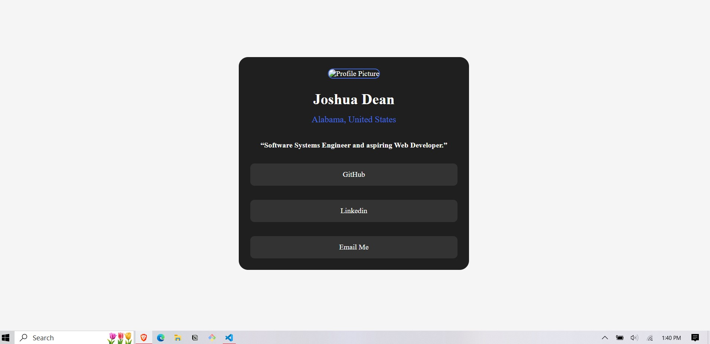

# Frontend Mentor - Social links profile solution

This is a solution to the [Social links profile challenge on Frontend Mentor](https://www.frontendmentor.io/challenges/social-links-profile-UG32l9m6dQ). Frontend Mentor challenges help you improve your coding skills by building realistic projects. 

## Table of contents

- [Overview](#overview)
  - [The challenge](#the-challenge)
  - [Screenshot](#screenshot)
  - [Links](#links)
- [My process](#my-process)
  - [Built with](#built-with)
  - [What I learned](#what-i-learned)
  - [Continued development](#continued-development)
- [Author](#author)
- [Acknowledgments](#acknowledgments)

**Note: Delete this note and update the table of contents based on what sections you keep.**

## Overview

### The challenge

Users should be able to:

- See hover and focus states for all interactive elements on the page

### Screenshot




### Links
- github url: [https://github.com/JDeanTech/Social-Links-Profile.git]


## My process

### Built with

- Semantic HTML5 markup
- CSS custom properties
- Flexbox

### What I learned

I learned a lot about hover feature in CSS and working to learn more about margin and padding it can be a little confusing.

To see how you can add code snippets, see below:

```html
figured out how to use a link to open in new tab :

<li><a href="https://github.com/JDeanTech" target="_blank">GitHub</a></li>
```
```css
was able to setup a few links with hover/focus features:

.social-links li a:hover,
.social-links li a:focus{
    color: hsl(0, 0%, 100%); /*this adds the white color to the text when hover is activated*/
    background-color: royalblue; /*this adds the blue color to the highlighted link hover*/
    transition: all 0.3s ease-in-out; /*this is to add a transition to the hover effect*/
    
}
```


If you want more help with writing markdown, we'd recommend checking out [The Markdown Guide](https://www.markdownguide.org/) to learn more.


### Continued development

In future developement im going to work on improving my ability to use padding/margin correctly


## Author

- [Joshua Dean]
- Frontend Mentor - [@@JDeanTech](https://www.frontendmentor.io/profile/JDeanTech)
- Github - [@JDeanTech](https://github.com/JDeanTech/Social-Links-Profile.git)


## Acknowledgments

This is where you can give a hat tip to anyone who helped you out on this project. Perhaps you worked in a team or got some inspiration from someone else's solution. This is the perfect place to give them some credit.


